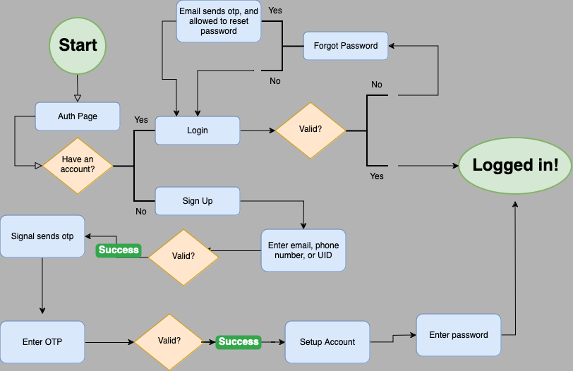

## Auth Flow

When a user first opens the app they're prompted with the options of signing up or logging in. Signing up takes them through the authentication process where they create their profiles.

1. The user picks their form of identification. The options are an email address, their phone number, or their UID. Upon submitting their identifier to the `api/v1/profiles/` with a POST request, they receive an otp code to their identifier.

2. The user enters their identifier to the `api/v1/profiles/actions/verify-otp` endpoint.

3. Once the user verifies this code, they are prompted to setup their profile. This is done by the `api/v1/profiles/actions/create-profile/` endpoint.

4. Then the user creates their password and are authenticated and admitted into the app. `api/v1/profiles/actions/create-password/`

## App Flow

After creating their profile, the user is logged in

`api/v1/users/login/`

and they connect via Websocket to the asynchronous part of the app to load friends, messages, and profiles to swipe left or right on.

> `api/consumers` has all the code for the asynchrnous connections. 

For the frontend, there are three main screens: the Swipe / Deck screen, the Chat / Friends screen, and the Profile screen. 

In the Deck screen, the user swipes left or right on profiles to either send friend requests or to pass. This is exactly like Tinder, swipe left or right and view details about the profile. This is where the two swipe endpoints in the ProfileViewSet come into play.

In the Chat screen, the user sees their friends. These are Connection instances (models.py) between two users with the accepted:boolean attribute set to true. Here users can send messages to each other which is done again through the socket. 

In the Profile screen, the user can update their profile (updating and deleting), pause their profile, and create or edit the matching quiz. 

### Other screens
* Search
* Message 
* Edit Profile
* Edit Matching Quiz
* Friend Requests

These are all the extra screens that go into the frontend. 